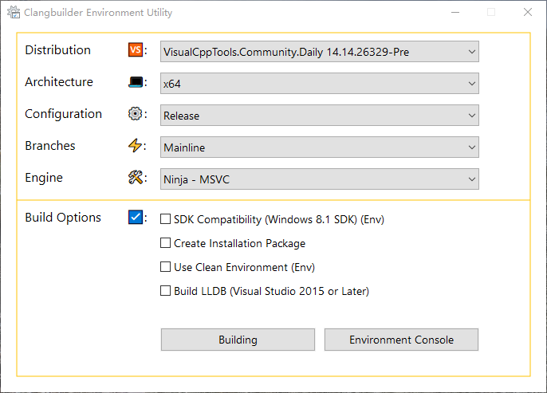
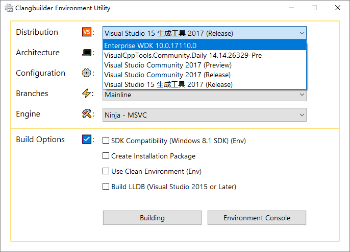

# Clangbuilder

Automated tools help developers on Windows platforms building LLVM and clang.
 

## Installation

### PowerShell Policy

Often you need to change the Power Shell execution policy

```powershell
Get-ExecutionPolicy
```

**Output**:

> Restricted

Please run PowerShell with administrator rights, and Enter:   

```powershell
Set-ExecutionPolicy RemoteSigned
```

### General Setup

Clone clangbuilder on Github

```shell
git clone https://github.com/fstudio/clangbuilder.git clangbuilder
```

Click the `script/InitializeEnv.bat`

The installation script will compile ClangbuilderUI and create a shortcut, download required packages.

If your need install `VisualCppTools.Community.Daily` ,click `script/VisualCppToolsFetch.bat`


## Build Clang on Windows

Clangbuilder Now Only support use Visual C++ build Clang LLVM LLDB. 

Best Visual Studio Version:

>Visual Studio 2017 15.5 or later

You can run ClangbuilderUI, Modify Arch, Configuration and other options. after click `Building`

**ClangbuilderUI Snapshot**


**Update 2017-08-19** Clangbuilder support **VisualCppTools.Community.Daily**:



**VisualCppTools.Community.Daily** current not support msbuild (becasue cmake ...)

**Update 2017-09-17** ClangbuilderUI Support EWDK



**Branch**

+  Mainline, master/trunk branch , git fetch from https://github.com/llvm-mirror/
+  Stable, llvm stable branch, like release_50, git fetch from https://github.com/llvm-mirror/
+  Release, llvm release tag, download for https://releases.llvm.org/


**CMake Custom flags**

You can custom cmake build flags Now !!!

Clangbuilder will check `$ClangbuilderRoot\out\cmakeflags.$Branch.json` and `$ClangbuilderRoot\out\cmakeflags.json` is exists, if exists parse cmake flags.

The corresponding branch takes effect:

```txt
cmakeflags.mainline.json
cmakeflags.stable.json
cmakeflags.release.json
```

Set `cmakeflags.json` will take effect in all branches (Mainline, Stable, Release)

Flags configuration format is json:

```json
{
    "CMake":[
        "-DCMAKE_INSTALL_PREFIX=\"D:/LLVM\""
    ]
}
```


**Engine**

+   MSbuild use msbuild build llvm
+   Ninja use ninja build llvm
+   NinjaBootstrap use ninja build and bootstrap llvm
+   NinjaIterate use ninja build llvm, but compile is prebuilt clang (config by `config\prebuilt.json`)

[prebuilt.json template](./config/prebuilt.template.json):
```json
{
    "LLVM": {
        "Path": "D:/LLVM",
        "Arch": "x64"
    }
}
```

**LLDB**

When you select build LLDB, If not found Python 3 installed. Clangbuilder add flag `-DLLDB_DISABLE_PYTHON=1`.

LLDB maybe not work.

**Libc++**

Only NinjaBootstrap and NinjaIterate will compile libc++ ,Because Visual C++ not support `include_next` now.

```powershell
clang-cl -std:c++14  -Iinclude\c++\v1 hello.cc c++.lib
```

copy `c++.dll` to your path(or exe self directory). Clang 6.0 or Clang trunk mybe no Warning.

When need support C++17 with `-std:c++17`,Please modify `new:+165`, Fix redefinition of 'align_val_t'.
See: [patch/libcxx-msvc-cxx17.patch](patch/libcxx-msvc-cxx17.patch)


**ARM64**

Build LLVM for ARM64 is broken, But You can download **Enterprise WDK (EWDK) Insider Preview** from https://www.microsoft.com/en-us/software-download/windowsinsiderpreviewWDK ,When you config `config/ewdk.json`, ClangbuilderUI able to start `ARM64 Environment Console`

[ewdk.json template](./config/ewdk.template.json):
```json
{
	"Path":"D:\\EWDK",
	"Version":"10.0.16257.0"
}
```

*Update*: Visual Studio 15.4 can install `Visual C++ compilers and libraries for ARM64`， CMake 3.10 will support ARM64. 

See: [VS15: Adds ARM64 architecture support.](https://gitlab.kitware.com/cmake/cmake/merge_requests/1215)

## Commandline

```cmd
.\bin\clangbuilder
```

## Custom PATH

You can modify [config/initialize.json](./config/initialize.json) , add some directories to PATH. Note that directories have **higher priority** in PATH.
 

## Suggest

+   Best Platform is Windows 10 x64 
+   Select `Use Clean Environment` will reset current process Environment PATH value, Resolve conflict environment variables
+   If your will build lldb, your should install python3.

```powershell
$env:Path = "${env:windir};${env:windir}\System32;${env:windir}\System32\Wbem;${env:windir}\System32\WindowsPowerShell\v1.0"
```
`$evn:windir` is usually `C:\Windows`

## Environment Console

When you only need to start a console environment, you can click on the `Environment Console`。

## Add Portable Utilities

You can modify `config/packages.json`, 
and then double-click `script/UpdatePkgs.bat` to the software you need as part of the Clangbuilder is added to the environment


## Add Extranl Libs

You can add extranl lib, such as [z3](https://github.com/Z3Prover/z3) , more info to view ExternalLibs.md

## About Ninja Task

**Ninja Task Parallel:**

```powershell
Function Parallel() {
    $MemSize = (Get-WmiObject -Class Win32_ComputerSystem).TotalPhysicalMemory
    $ProcessorCount = $env:NUMBER_OF_PROCESSORS
    $MemParallelRaw = $MemSize / 1610612736 #1.5GB
    #[int]$MemParallel = [Math]::Floor($MemParallelRaw)
    [int]$MemParallel = [Math]::Ceiling($MemParallelRaw) ## less 1
    return [Math]::Min($ProcessorCount, $MemParallel)
}
```

## Copyright

License: MIT  
Author: Force.Charlie  
Copyright © 2018 Force Charlie. All Rights Reserved.

