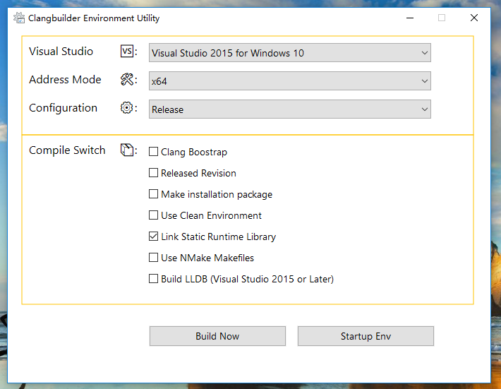

# ClangBuilder

ClangBuilder is Build Clang Environment On Windows. Fecth Packages, Auto build

## Installation

### Usually

Download from Github, If your known use Git

```shell
git clone https://github.com/fstudio/clangbuilder.git clangbuilder
```

Click the *Install.bat* in the clangbuilder directory, this will run PowerShell startup  *bin/Installer/Install.ps1* 

It is recommended that whenever you have PowerShell scripts, and try not to delete the project file in the tools directory.

Similarly, you can start a PowerShell runs Install.ps1, generally run PowerShell scripts on the Windows right-click menu option, you can right-click the menu "*run with PowerShell*"
Above procedure does not require administrator privileges.

If you are unable to run the script, please enter

```powershell
Get-ExecutionPolicy
```

**Output**:

> Restricted

Please run PowerShell with administrator rights, and Enter:   

```powershell
Set-ExecutionPolicy RemoteSigned
```


#### Web Installer

PowerShell, Enter:

```powershell
&{$wc=New-Object System.Net.WebClient;$wc.Proxy=[System.Net.WebRequest]::DefaultWebProxy;$wc.Proxy.Credentials=[System.Net.CredentialCache]::DefaultNetworkCredentials;Invoke-Expression ($wc.DownloadString('https://raw.githubusercontent.com/fstudio/clangbuilder/master/bin/Installer/WebInstall.ps1'))}
```

Or CMD Enter:

```cmd
@powershell -NoProfile -ExecutionPolicy unrestricted -Command "&{$wc=New-Object System.Net.WebClient;$wc.Proxy=[System.Net.WebRequest]::DefaultWebProxy;$wc.Proxy.Credentials=[System.Net.CredentialCache]::DefaultNetworkCredentials;Invoke-Expression ($wc.DownloadString('https://raw.githubusercontent.com/fstudio/clangbuilder/master/bin/Installer/WebInstall.ps1'))}"
```

By default **Your Should Input Your Clangbuilder Install Loaction!!!!**


## Clang on Windows

Clangbuilder Now Only support use Visual C++ build Clang LLVM LLDB. And Best Visual Studio Version:

>VisualStudio 2015

Aslo, Your can use MSYS2, use pacman install Clang.

```shell
pacman -S clang
```

## Automated build

run

```cmd
PowerShell -File .\bin\ClangbuilderManager.ps1 -VisualStudio 120 -Arch x64 -Flavor Release -Clear -Static
```


## ClangbuilderUI

Your can click ClangbuilderUI, select your Visual Studio Version and Arch, and configuration



## Commandline

```cmd
./bin/clangbuilder
```

## Suggest

+ Best Platform is Windows 10 x64 (ClangbuilderUI Require Windows 8.1 or Later, Windows 7 should use cmdline)
+ -Clear flag will reset current process Environment PATH value, Resolve conflict environment variables
+ Build LLDB require Visual Studio 2015, When you not install Python 3.x ,Clangbuilder will download python.exe after inform you install.
+ Build LLDB, not test on Windows x86, maybe cannot find PYTHONHOME.


## Copyright

Author: Force.Charlie  
Copyright © 2016 ForceStudio. All Rights Reserved.

