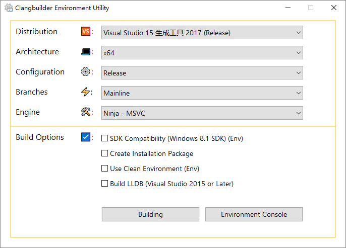

# Clangbuilder

Automated tools help developers on Windows platforms building LLVM and clang.
 

## Installation

### PowerShell Policy

Often you need to change the Power Shell execution policy

```powershell
Get-ExecutionPolicy
```

**Output**:

> Restricted

Please run PowerShell with administrator rights, and Enter:   

```powershell
Set-ExecutionPolicy RemoteSigned
```

### General Setup

Clone clangbuilder on Github

```shell
git clone https://github.com/fstudio/clangbuilder.git clangbuilder
```

Click the *Install.bat* in the clangbuilder directory, this will run PowerShell startup  *bin/Installer.ps1* 

The installation script will compile ClangbuilderUI and create a shortcut, download required packages.

Directory layout is as follows:


## Clang on Windows

Clangbuilder Now Only support use Visual C++ build Clang LLVM LLDB. 

Best Visual Studio Version:

>VisualStudio 2015

Additional, Your can use MSYS2, use pacman install Clang.

```shell
pacman -S clang
```


## ClangbuilderUI

Your can click ClangbuilderUI, select your Visual Studio Version and Arch, and configuration



## Commandline

```cmd
./bin/clangbuilder
```

## Suggest

+ Best Platform is Windows 10 x64 
+ Select `Use Clean Environment` will reset current process Environment PATH value, Resolve conflict environment variables
+ If your will build lldb, your should install python3.

## Environment Console

When you only need to start a console environment, you can click on the `Environment Console`。

## Add Portable Utilities

You can modify `config/packages.json`, 
and then double-click install.bat to the software you need as part of the Clangbuilder is added to the environment


## Copyright

Author: Force.Charlie  
Copyright © 2017 ForceStudio. All Rights Reserved.

